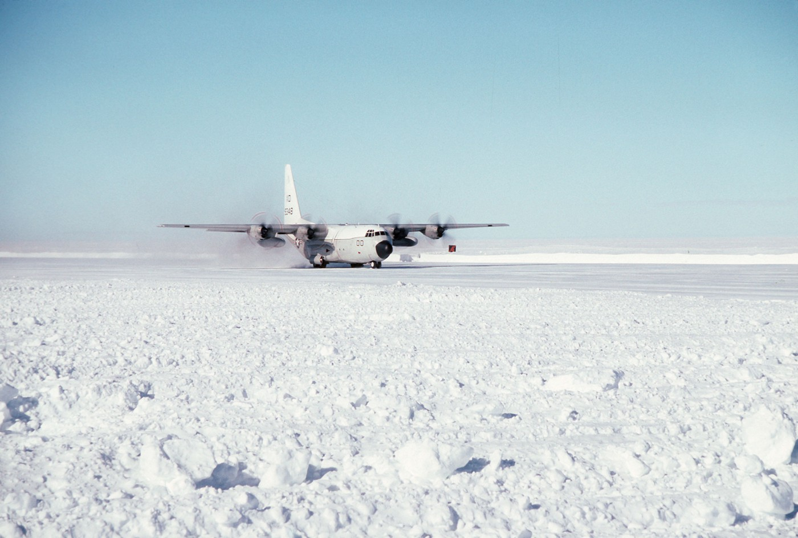

# Chapter 1 — No Turning Back (Continued from “Zero of Antarctica”)

Zero was scared, his face wet with tears, speeding on his bike across the Cosmic Expanse. Far in the distance, the Great Garbage Mountains encircled him. Ahead of him, and getting closer by the minute, the Main Pipe topped with it’s defense turrets, and a Radar Tower so large and tall, Zero already had to look up to see the red blinking lights near its top.

Zero had escaped the attack on his farm, but now must live as an Antarcan Nomad. His Beacon broken, with little chance of finding his people, he must now bring the war back to the Humans. So steadily he rides over the ice sheet, weaving between jutting rocks covered in ice and snow. On and on towards the Main Pipe and Radar Tower.

Earlier while Zero was still at the farm, Human HQ at the Radar Tower gets a call from a Scout team. The Scouts have been investigating a nearby scrub forest, and potential Antarcan Hive. These lowland rivers and scrub forests provide ideal locations for Geothermal Farms. The Sniper called in a location confirmed to be an Antarcan Hive, and so the Rapid Air Assault Team was called in.

# Chapter 2 — Rapid Air Assault Team

Ray was on his regular shift when the call came in. “Blip Confirmed! RAAT on the way!” replied Ray in his excitement, and slammed down the phone. His heart racing, he tried to stay focused. This was far from a typical day on his shift. Day after day sitting by the phone, routine calls from Scouts, “Nothing found, heading back” or some variation. Ray sprinted across the Hanger Complex, to Launch Control. He could have just called it in, but he knows how slow and difficult that can be. Instead he decides to make the dash across the massive hanger directly to the Captain on Guard.

Passing row after row of Bomber Helis and Troop Transports, with crew milling about like any other day. He considers just yelling “Get in the choppers!”, but then thinks better of it. No, it would just cause a panic, we need to follow Chain of Command. The Bomber Helis tower above him, row after row. As he runs, he imagines them launching in a furry of sound, light, and shock waves from engines powering up.

“Captain… had to come myself… Fast Action… Location Confirmed” said Ray between big gulps of air. “Now you’re sure about this one Ray?” asked the Captain. Ray nodded, returning the Captain’s stare “Just got the call, verified blip on tracker”. The Captain lifted his phone as Ray handed him the tracker display.

Ray would later remember how strange the next moments felt. As the Captain got off his phone, nothing happened initially. Then there was suddenly a flash of emergency lights all around. No sound yet, just flashing on ever wall, every console. Then people started stirring, talking louder, moving quicker. Then the Launch Alarm sounded, and all hell broke lose.

The thunder of the massive vehicles shook Ray’s legs, and he felt me may go deaf, but did not dare cover his ears. Doing so in front of the Captain seemed like a career limiting move.

# Chapter 3: Refugees

“Over there, by the big rock, stop the Jeep” said Minus. “Stop? No way, we gotta Scatter!” replied Wedge and continued driving at top speed away from the incoming Human RAAT. Other vehicles still close by, but bikes breaking off here and there. A large convoy of slower vehicles was nearby to the left, and the large bolder ahead and to the right. “Wedge, she’s tracked, her leg” explained Minus.

Wedge lurches forward as he hits the breaks, and swerves right around the bolder. It’s not a place they should be staying, but the tracker must be removed immediately. Minus pulls her knife and some bandages, and the Jeep rolls to a stop behind the bolder. Wedge watches as the convoy of slower vehicles heads off to the left. Farther in the distance, the Human vehicles at first a blur, then visible as Bombers and Transports. The roar of the attackers getting louder as it approaches their little farm and the escaping convoy.

“Sami, this is going to hurt, but it’s just a little sting OK?” said Minus. Sami nodded, and closed her eyes, bracing herself. Sami was scared and confused, but also knew she wanted that prickly thing out of her leg. Minus worked with quick decisive movements. Swab, cut, wash… there it is, tweezers, and out.

“OK that’s the worst of it Sami”. Sami was expecting worse, so she smiled at Minus. “OK, we gotta keep moving” said Wedge, as the Helis were getting closer. “We’re good” said Minus as she tossed the tracker out the window. Wedge hit the gas, and veered further right to get clear of the tracker, and separate from the convoy. Wedge knows staying grouped together out here is a good way to get bombed.

# Chapter 4: Last Stand

Before the Human attack, Wedge the Engineer had been living a pretty good life. Often so deep into his work he could forget about the Human threat for hours at a time. Sometimes he smiled to himself, and just said a little prayer of gratitude that he had found his calling amid all this chaos.

On the day of the attack, he was working on a laptop that was found on a recent scavenging run. It must have been a hundred years old or more. But he had many more ancient pieces in his collection. This one was special in that much of the core power components still functioned. With his scopes and tools, Wedge was slowly hacking through the BIOS, trying to reverse engineer it, and get the basic IO ports working.

When Zero came running in to tell Wedge about some Humans nearby, Wedge had just got the onboard keyboard to light up, a major step forward. As Zero ran back out the door, Wedge felt light headed and sat down for a second. “No time.. no time…” he muttered and pulled himself together. He ran to the electrical room, and hit the Main Alarm breaker. It worked as a constant low power signal that suppressed the alarm. Once the Main Alarm is activated, the order is immediate evacuation taking only essential gear. Wedge quickly unhooked the laptop, and stuffed it under his arm. Again he paused as he tried to think of how he might carry more of his precious toys with him.

“No time…” a voice kept saying, and realizing it was his own voice, he again pulled his focus to the moment. He raced to his room laptop in hand, grabbed his Beacon, and Go Bag, and ran to the Garage. By the time he reached the Garage, the main door was lifting slowly up, displacing a layer of soil, rocks, and small trees. The screeching and grinding of metal was complimented by motors revving and people screaming at each other to be heard. A group nearby was arguing, and Wedge ran over to see what was going on.

“Why are you all standing here? Drive!” Wedge bellowed over the arguing groups. “They won’t leave” said one of the first group. An older Antarcan from the second group confirmed this. “We’re done running, this is where we stand, we’re breaking our Beacons”. “No time..” echoed the voice in Wedge’s mind… “Give me your Beacons. Yeah, give me them now” said Wedge in his most matter of fact way. “In the Jeep, yep, OK” he said as several Antarcans handed over the Beacons, and Wedge loaded them into the back of his jeep. The crowd dispersed to either their vehicles, or to a corner of the Garage to prepare for their last stand.

Wedge was frustrated, and wished he could talk sense into these people. But with the Human assault on the way, every moment they wait puts them at risk. He drove out of the Garage, up the river bank, scanning for Zero. Wedge had not seen him in the Garage, and they had agreed they would connect before an evacuation if possible. So Wedge decided to make a pass around some common meeting places before heading off to scatter.

While most were leaving, the few remaining Antarcans went down to the Armory deep at the bottom of the farm to make their last stand.

# Chapter 5 — Bombing Run

When the Main Alarm sounded, Stretch was in his room sleeping. Before he had even woke up, he was already grabbing for his Beacon and Go Bag, and stumbling down the hall to the Garage. Yawning as he went, he picked up a helmet and looked for a bike… but then he froze. Fear gripped him like never before. This was not a dream, this was not a drill, this was happening. The thought of going out there, getting blown to bits or shot terrified him.

The helmet dropped from his hand, but nobody noticed. They were too busy arguing about something. Then some started to hand over their Beacons, and he understood they were staying. Stretch quickly stuffed his Beacon down the back of his belt, and lifted his shirt over it. He side stepped over to the group in the corner who were staying. The group talked for a bit, and then decided to head for the Armory and hold out there.

Stretch followed the group, but made sure to stay at the back. He followed them down to the lower levels of the farm towards the Armory. As the group weaved through makeshift tunnels of the lower farm, Stretch suddenly just stopped. Nobody noticed, they just kept running. Stretch knew this place well, and thought about where he could hide.

He remembered a part of the farm that was blocked off. Part of it had collapsed, and nobody got around to fixing it yet. It looked like any other wall panel, but Stretch knew how to pop out the panel, climb in, and replace it. He checked his Beacon, and made sure it was safe, but not active. There he stayed for a very long time in silence. His heart rate slowed, as did his breathing. He was in a form of stasis that Antarcans are able to achieve to survive against their harsh homeland.

The RAAT troop transports were landing, and beginning to unload vehicles and scores of infantry. Troops began assembling into formations, as the Bombers continued to chase the escaping convoy. The slower vehicles of the convoy were easy targets for the Bombers. As they came into range, a massive barrage of rockets decimated the convoy. If any survived, they would surely now be Nomads.

The bombing was intense, but still many faster vehicles had escaped and scattered out of range. The Bombers are fierce, but they cannot stay out long as they have limited fuel. They turn back once the main convoy has been destroyed. They will return for a second run after the farm has been raided. The Humans first need to secure the farm, and thoroughly investigate it.

Once the Human Troops have gathered anything useful, and killed any remaining bugs, they will leave. The Bombers will then turn the little scrub forest by the river into a scorched wasteland.

# Chapter 6 — Antarcan After All

Early on the day of the attack, Minus was at her usual post. Watching, listening, waiting. She nodded at Sami as she passed, out gathering her rocks again. She tried to remember when she was that age. She then realized how long she’s been doing this, and chuckled to herself. “No way but to go a bit crazy I guess…” she said to herself and smiled. She understood as well as any how hard it can be, and noticed how everyone had their little ways to pass the time. Zero with his Kush, Sami with her rocks, Wedge his tech, and herself?

Minus knew deep down this calm could never last. She was surprised it had so long, and that people seemed to just get used to it. That part of her that expected the Human attack was always there. Always in the background. She realized now, that’s what made her different. She just couldn’t shut it off, and it was a curse she was born with. However on this day, it became a blessing. Today Minus would hear something unusual, or least her ears would hear it. But it was so distant, it was barely a whisper. As quiet as it was, so was it unmistakably a Human laughing.

At first Minus just felt suddenly queasy. She looked around for Sami, but she was not to be seen. “Sami”? she called… but then realized her mouth had not uttered a sound. In fact, she could not speak even if she wanted to. Her heart was beginning to race as she found herself rushing towards her room to pack. As she went, a sound kept echoing in the distance of her mind. That sound, that laughing sound, could it really be? a Human? She quickly grabbed her Beacon and Go Bag, and then raced back to find Sami.

“Sami?” called Minus as she stood up, and closed the rusty iron hatch. Sami recognized her voice, and peeped out from behind her hiding spot. “I’m hiding!” exclaimed Sami. “Very good hiding spot!” said Minus with great relief “ I would have never found you!”. She walked over and held out her hand to Sami.

# Chapter 7 - Armory

Vee was older Antarcan woman. When the Evac alarm sounded she was in the mess hall playing cards with her crew. This was a group of Antarcans that had joined the farm a few years ago. They were refugees from another farm that had been raided. They were inseparable and could often be found here drinking, playing cards, or brawling. As the lights and sirens went off, the whole crew looked at Vee.

“Well, go on get your Beacons!” chuckled Vee and slowly rose from her seat. Vee already had her Go Bag with her Beacon within. She always carried it with her, old habit. “Meet in the Garage, GO!” yelled Vee. She strolled over with a slight limp to the Garage as people rushed around her. Her resolve hardening as she walked. “No more running…” she muttered to herself bitterly.

When the crew had all reached the Garage, Vee broke the news. “Listen! I’m staying, but you guys need to scatter now” commanded Vee. “Then I’m staying too” said one of her crew, and the rest nodded. This caused an argument, most demanding that they all leave, but some resolved to stay. Vee sighed, and took out her Beacon, holding it as if to break it. Just then Wedge interrupted them, demanding that the remaining hand over their Beacons. Vee agreed “No point wasting them.” and continued shouting “Those staying, with me!” and strolled to a nearby corner of the Garage.

“OK Nomads, what now?” Vee joked, trying to lighten the mood. Her crew had learned to depend on her and look to her for answers. Nobody answered, they just looked at each other then back at Vee. “OK, you guys are going to have to be sharper than that” scolded Vee. She now leaned in and lowered her voice “We set up an ambush in the Armory, then displace out the back tunnel if they push us, understand?” asked Vee patiently. Nods all around, and with that they followed Vee. So whether it was to scatter or follow Vee, soon everyone had left the Garage.

Vee and her crew raced down to the Armory, and got geared up. “We have at least a few minutes, so gather water, food, ammo, but fast” said Vee. She sent a few to gather supplies, and the rest set up cover. They built up makeshift fortifications and took position behind with their supplies. Behind them was a long narrow tunnel that lead into a small cave which served as a back door.

Vee could handle a lot, but that tunnel terrified her. The thought of getting halfway and then stuck… she turned back to face the door rifle at the ready.

“Nobody fire, nobody even breath until I say so!” said Vee as they waited, ready to ambush the Humans.

# Chapter 8 - Impossible Dream

Zero had been driving a long time, and eventually the shock of recent events wore off. He realized if he kept going he would drive right into the Human perimeter spotlights and turrets. He skidded to a stop, and pulled off his helmet. Throwing his helmet to the ground, he screamed “Why?!”. Without his family and friends and the small comforts of home, he was at a loss for what to do next. His naive childhood dreams of brave Nomads climbing up the Main Pipe into Earth seemed ridiculous now. The light of a new dawn was rising, and in the stark light of day the task seemed utterly impossible.

The massive Main Pipe and Radar Tower loomed above. Spotlights still active, but faded with the dim light of dawn. Zero scanned the horizon, and noticed some smaller mountains of garbage off to his left. It was not far, and would provide him some cover as he planned his next move. Antarcans can survive for long periods without food and water, but not forever. Zero had some rations, and water was plentiful from the ice and snow all around. He would have to find more food eventually, but for now he needed to rest and think.

So he put his helmet back on, and veered left over to the nearby mountain of garbage. He took his bike up as high as he could go, which was about a third of the way up. He didn’t want to leave his bike to climb higher. He looked around this level, and found a soft spot in the frozen matted layers of garbage. Picking, digging, pulling until he had hollowed out a spot for him and his bike. He packed mounds of trash around his little hollow to hide it. There he sat and wept, everything catching up to him.

As his tears dried Zero realized he was really on his own now. No more chatting with Wedge, or sitting topside with Minus. A resolve now hardened in Zero as he turned his thoughts and gaze towards Earth. The fear and frustration was leaving him and being replaced by extreme fatigue. He fell into a deep long sleep there on the garbage mountain. In his sleep he would dream he was sitting topside with Minus like he did so often.

Minus was a lot more talkative in his dream. She told him “You will never get up that pipe Zero, but there might be another way…”

“Go on.. “ replied Zero. “First let me try that” said Minus. “This? but you don’t smoke” replied Zero as he handed her the joint. As Minus smoked the joint, instead of getting shorter it was getting longer. “Woah neat trick!” said Zero as he took the joint back.

Then Sami showed up and handed him a rock. It was round and painted blue and green and fit nicely in the palm of his hand. “This will bring good luck!” said Sami as she ran away laughing.

Zero woke to a distant boom back in the direction of the farm. He had slept long and it was day again. “Another way huh?” Zero said to himself as he crawled out enough to get a good look at the Radar Tower, and the walls surrounding it. “Maybe…” he said to himself as he packed a little bowl and had a smoke.

