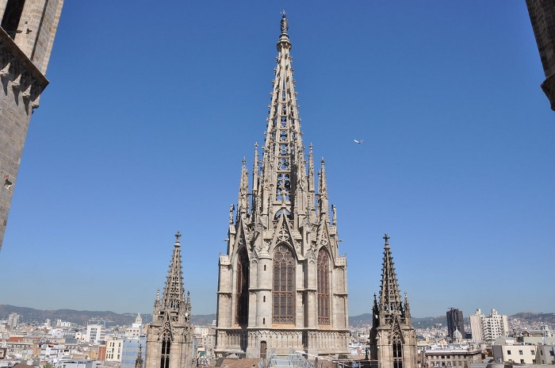

# Book 4: Zero and The Blue Cathedral

## Chapter 1: Change of Plans

“Move people, get to the bikes” shouted Vee as her team continued up the ledges of ice. As they reached the forest floor, they turned a sharp corner and ran along a narrow path through the trees. Soon they reached a small shed with some bikes. “OK Nomads, there’s no pretty way to say this, we’ve got a fight on our hands” said Vee as the team gathered around. “Now some of us may not make it, but…”

Stretch couldn’t take one more word of this, and fell to his knees. “I’m sorry, I’m so sorry…” he sobbed, continuing “Please take it, forgive me”. He was holding up a working Antarcan Beacon. Vee quickly grabbed the Beacon and inspected it. “Not sure if I want to kill you or kiss you right now Stretch” joked Vee. As the team started to laugh to each other Vee snapped “Quiet!”. Vee knew that a working Beacon changed everything.

“New plan, we scatter” commanded Vee as she mounted her bike. Vee then looked at Stretch “Hop on Stretch” said Vee, and Stretch hopped on the back of Vee’s bike. “That would be now people!” Vee yelled as she took off along the narrow path. The rest got on bikes and followed.

They used the back ways to get up onto the Cosmic Expanse. Some Human troopers saw them from a distance, and started running towards them and shooting. The Humans were hopelessly out of range, but kept pursuing on foot.

“Not gonna get far like that” chuckled Vee. She checked her six, then maxed the throttle out over the Cosmic Expanse.

## Chapter 2: The Signal

Wedge, Minus and Sami had escaped the RAAT and made camp on the Cosmic Expanse. They are now attempting to make contact with other refugees.

“Ready to try again?” asks Minus, Sami smiles and nods. This time to their great relief many small blips come back. “Some good handshakes” mumbles Wedge as he watches the lights on his display. “Is mine broken?” asks Sami, lifting the Beacon to Wedge. “No, you just need to point it… wait a sec…” said Wedge, confused by the display. He switches back to his display “Are you seeing this Minus?”.

Minus checked her Beacon display, and sure enough there was something out there. It wasn’t in the direction of the refugees, it was further out on their current heading. “I’ve never seen that kind of power…” Wedge remarked. “Is that a good thing, or a bad thing Wedge?” asked Minus. “Good question…” mumbled Wedge, deep in thought. The signal stopped suddenly. For better or worse, this was according to all known Antarcan protocols.

Minus was thinking out loud… “maybe we creep towards it, let others catch up? I mean, they’re seeing this too right?”. Wedge agreed “Minus that’s a brilliant idea!”.

Wedge liked the idea of a slower pace for a change. Who knows, he might even find some bits of tech here and there. Although the farther they went, they less likely it would be Human tech.

## Chapter 3: Guilty Pleasures

Zero smiles at a regular as he pours a yet another coffee. “Boy do Humans like their coffee” muses Zero. Suddenly everyone is looking at the TV. “…unconfirmed reports of an Artarcan strike on the Radar Tower.” The cup drops from Zero’s hand as he looks up in amazement. He can see everyone else is very upset, but he can barely contain his glee.

“Can I take off? I’m not feeling well…” Zero asks the Human working cash. “OK Zero, Feel better, eh? See you tomorrow AM, OK buddy?” replies the Human.

Zero dances the night away in celebration at a local club. At least nobody here seems to care about the Antarcan attack. He doesn’t like their alcohol, but he loves dancing to their music. As he looks around at these Humans, he starts to feel a bit guilty. The dock workers, the people on the beach. He realizes these people don’t deserve it either.

He was lost in thought with this head propped on his hands, elbows on the bar. Just then he looked over and saw the most beautiful creature he had ever seen, Human or Antarcan, staring right back at him.

They danced close for a few songs, but then Zero felt unsure. His long hair hides the pulsing blue veins behind his ears. “I want to talk more…” Zero blurted out. He didn’t know how else to say it. The woman started chuckling, and then looked away.

Then she just kept laughing, and had to go sit by the bar. Zero hoped she was OK, it took her a long time to calm down. She grabbed a napkin from the bar, and asked the bartender for a pen. She wrote down “Mary” with her phone number below, and handed the napkin to Zero.

“I should go anyway” Mary said, and quickly left the bar. He watched her as she went, and he waved as she looked back and winked just before leaving the club.

## Chapter 4: Reunion

“That was fun!” said Sami as Minus closed the window. She enjoyed waving at the bikes as they merged with the growing convoy. Each day more and more would join, but so far no sign of Sami’s Mom. “There’s still a lot more on the way” comforted Minus.

Minus feared Sami’s Mom was in the lost convoy, but there was really no way to know. Antarcans are Nomads first, and farmers second. So when it’s time to ride, they ride, and find each other on the way.

“Are you receiving?” asked Wedge speaking into his transmitter. A multitude of various acks came in, and Wedge interrupted “OK, OK!”. Wedge had established convoy comms, and was now the de-facto leader. Nobody had any idea what they would find, so it was determined they would make camp.

“Let’s get everyone together before we go any closer” ordered Wedge, and the convoy came to a stop. So they made camp, and it was becoming a rowdy one at that. Much celebrating the reunited and remembering the ones lost.

When Sami saw her Mom she was beside herself with joy. She ran over and jumped into her Mom’s waiting arms. “I would drive straight up that pipe if you were on Earth my girl” said her Mom.

## Chapter 5: The Blue Cathedral

The reunited Antarcan convoy now continued towards the signal. The cold winds blowing and only the lights from the the stars and their vehicles.

“Look!” Minus pointed, now sitting in the front with Wedge. In the direction of the signal, there was now a visible blue light forming in front of them. Sami snuggled in her Mom’s arms in the back seat as the jeep continued onward. As they got closer, they could see tall spires of ice far in the distance.

Minus could swear she had seen this before, maybe in a dream. The Antarcan convoy continued towards the icy blue spires in the distance.
