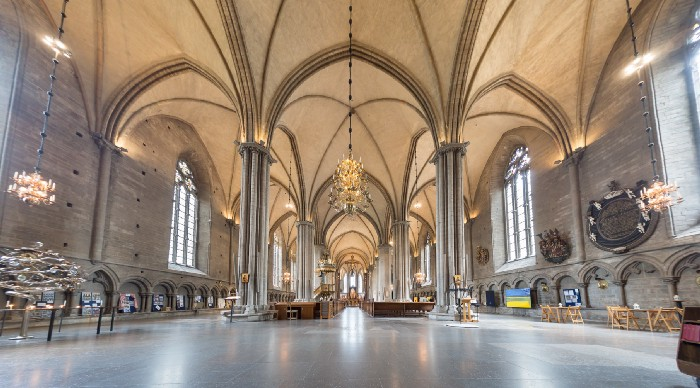

# Book 5: Zero and The Noumena

## Chapter 1: The Blue Council

The Blue Council was in session after the Antarcans had recounted recent events. These glowing blue creatures called themselves Noumena, and they lived in a towering Cathedral of ice.

Minus and her fellow Antarcans remained in awe of this place. The halls seemed to go on forever with huge columns of ice at regular intervals. Minus loved to explore, which was tolerated so long as a Blue Escort accompanied her.

“Bring those few who will hear our council” boomed a voice from the council chambers. It was chosen that Minus would certainly go, as she had some connection with these creatures. Wedge and Vee also came to hear the decree. When all were assembled, the decree was delivered in a booming voice.

“We the Blue Council deliver this decree. Action must be taken to protect lives from this Vomiting Cyclops. We have in our possession a Weapon of great power. We decree that this Weapon shall be given to the Antarcans. This gift has two conditions. One, you must never let the Cyclops or its allies know the secrets of this Weapon! Two, you must use this Weapon on the Towering Eye, to blind this beast. More action may be necessary, but this at least must be done. So it is decreed!”

## Chapter 2: Testimony

Earlier, before the Blue Council had started its deliberation, it heard the testimony of the Antarcans. When it was Minus’ turn, she stood alone in front of the booming voice.

“What is your name Young One?” asked the booming voice, as it had for each Antarcan who wished to speak. Minus replied, and then the voice continued.

“Minus, what is your testimony?”. By this they meant for Minus to recollect the recent events in her own words. As Minus recounted the events, the voice occasionally asked her some questions. After Minus was silent for a time the booming voice said “Thank you. Next!”

It felt great to get all that off her chest. Some Antarcans spoke long, some were emotional, and one by one the Blue Council heard them all.

## Chapter: Payback

“We only get one shot at this” Wedge reminded the team. They were positioned on a smaller mountain of garbage overlooking the walls. Cold winds blowing through the dark night air. High above them loomed the Radar Tower. Wedge was adjusting the aim at the closest leg, which was made of a thick metal.

“Once I enable the targeting light, they will spot us, not to mention when I turn up the heat” laughed Wedge. They had set up a sabotage device, and also some traps in case the Humans tried to recover the device. Their vehicles were nearby, masked by piles of trash.

Wedge enabled the targeting light, and a solid white beam instantly hit the wall below the leg. Wedge quickly adjusted it up to make sure it would hit the metal part. The Humans by now had their spots on the Weapon, and flashing lights could be seen all over. Then he enabled the heat beam. “Everyone stay behind this thing!” he yelled as the beam began to saturate.

The beam turned red, then blue, then white again as it heated up. The metal leg of the Radar Tower began to glow and melt. The lights on it flickered and went out, and it flopped over to the side, but remained upright. Molten metal dripped down the walls, and hardened. Suddenly the beam stopped having exhausted its charge. Wedge quickly hit the sabotage button, and the smell of burning tech filled the air.

“On me! Scatter to the farm!” yells Vee. She lights a glowing blue flare on her sholder and speeds off towards the old farm.

The Bombers chased the Antarcan team far past the farm, but could not get into firing range. Just before the Bombers turned back, they fired a futile volley of rockets.

Seeing the Bombers turn back, the team stopped and cheered. They adjust course back to the Cathedral to report their success.

As they go, they hear a low rumble further on the previous heading.

## Chapter 4: Propaganda

“If ya spot a bug, speak up!” yelled bright official posters as Zero made his way to work at the Human coffee shop.

## Chapter 5: What? What?!

“What? What?!” yells the Ice Giant as the bombs explode all around it. The Ice Giant takes a long toke of Kush, throws down the joint, then slams its fist down onto the Main Pipe. It’s dented near the middle, but otherwise still functional.

The Ice Giant then heaves itself up from its seat on the garbage mountain. It strolls off towards the old farm. Nothing the Humans do has any effect on this creature.
