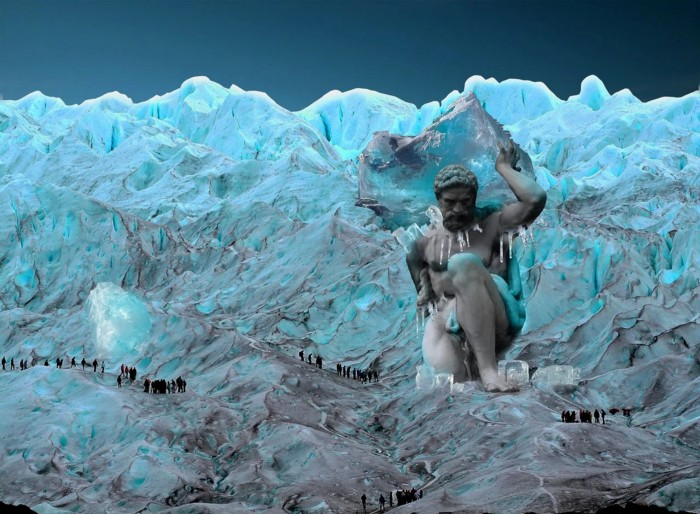

# Book 6: Endgame

## Chapter 1: The Farm

The Ice Giant was tending to his flock. He heard great booms in the distance. He made sure to ask his brother to take care of his flock. He was going to see what this terrible noise was, he was furious. His brother made sure to remind him to bring the burnt offering.

The Ice Giant calmed himself, and nodded. With the offering in hand, he lumbered off in search of the source of this terrible sound. He found trails that lead him to a Cyclops. This beast had been blinded it seems.

The Ice Giant saw a smaller mountain nearby, and decided to sit. All this while so many flies had been buzzing around, he swatted as many as he could. It was no use, more came from the Cyclops itself. Then as he sat, he lifted up for a moment, and then back down. Something was under his bottom. He picked up and used a skill knows as “Yeeting”.

Then he studied this Cyclops. He decided to mark it, to better remember it. “Perhaps later I will bring my brother to close this, that should fix the problem.” He lumbered back to the farm to tend to his flock, and talk with his brother. The flies followed for a bit, he left them be for now…

## Chapter 2: Night Wolves

Meanwhile at the Blue Cathedral…

“Oooh…” exclaimed Minus as another Night Wolf was slain by the Blue Escort. It really didn’t seem fair, yet wave after wave they came and died.

Vee has been training in their Martial Arts.

## Chapter 3: Open House

Zero has just pushed Ray down the sewer pipe…

As Ray slides down and down the pipes, he sees all kinds of creatures. Insects, snakes, reptiles, even Feral Antarcans watch hims as he falls screaming down the pipe. Ray realizes he has fallen into the worst kind of hell imaginable, and prays he can make it out of this alive.

There is a steady stream of hot garbage pulling him down and down. Finally he is about to be spit out the pipe. He lunges for a piece of exposed rebar at the end of the pipe, and holds on for dear life.

Then he sees a crack back up higher in the pipe, he could wait there if he could get to it. He notices the water ebbs and flows. He waits for another big splash of garbage, and when the water pulls back he quickly runs into the crack.

The water comes rushing and spraying out just as he lodges himself there. Ray knows he is by no means safe, but he thanks God he is alive. Then he imagines if he had been stuck with those creatures in the upper pipe… He shudders and he lodges himself deeper in the crack.

## Chapter 4: My Lucky Day

After what seems like an eternity waiting in that crack Ray sees something amazing. He sees a giant glowing being walking towards the Main Pipe holding a spliff. As the RAAT attacks this being, Ray wonders if he can jump down. It looks too far, he decides against it. Rays entire frame reverberates as the Giant slams its fist on the pipe. Suddenly Ray is on the ground.

Stunned, but alive he crawls right behind the Giant as it walks away. He crawls up the small mountain it was sitting on, and finds a hole in the ice. To his great astonishment, he finds an Antarcan bike has been stuffed in the side of the mountain. He knows if he is spotted here, the guards will just shoot him.

So he drags the bike down with him, slowly backing away toward the old Antarcan Geothermal Farm. It’s been raided and bombed, but he suspects he can find shelter and supplies there. When he feels he’s far enough, he speeds away towards the farm.

## Chapter 5: Fallout

An emergency War Council was called when the Blue Council heard of the Ice Giants being stirred. The Blue Council delivered an additional decree:

“Consequences are like ripples in still water, and sometimes must be calmed. We decree that an Emissary shall be chosen from your ranks, and sent to Earth. Calming these ripples is of the utmost importance. Otherwise, all the good work we do is undone by neglect. We shall grant this Emissary longer life, and ensure they appear Human.

We The Blue Council nominate Vee as Emissary on Earth.”

Now the Blue Council addressed Vee directly “Young One, only you can decide if you will take up this mantle. Will you serve the Blue Council, and help us still the waters?”

Her crew had never seen Vee cry until this moment.
