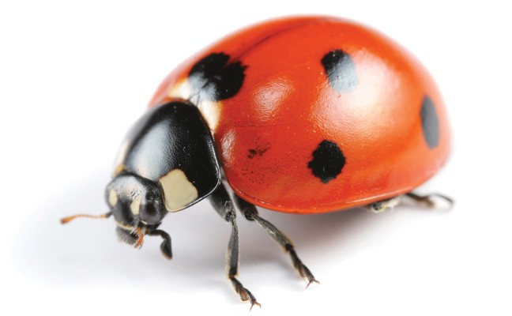

# Book 7: Insect Party

## Chapter 1: Beachhead

“What’s that smell?!” bellowed the Captain. “It’s the reefer, still a lot to go…” replied the Guard. They had been collecting the remains of the Ice Giant’s joint. They were sending it down to the lab. The Doctor there is trying to make a Bio Weapon that targets Antarcan DNA. “Well hurry up!” bellowed the Captain.

Just then a massive snake devours the Captain and slithers away. The Guards look at each other, and then all hell breaks lose. Reptiles are everywhere, not to mention the snakes and insects. Some very large insects at that. There are many small insects, and some larger ones that give orders to the small ones. In short, it’s quite a shit show.

The Human base is quickly evacuated when the scale of the catastrophe is discovered.

## Chapter 2: Elixer of Life

“Aw Bitter!” exclaims Vee as she drinks the glowing blue vial. “Now rest Young One, and bear down on the pain” says the glowing blue nurse. Vee rests there while the elixir takes effect. It reverses the aging process in her cells, and takes considerable time. While this is happening, they make minor DNA adjustments to make her blend in as Human.

Vee’s crew cheer when they see the new younger Vee. “Don’t be fooled, it’s the same old gal” laughed Vee, as she spun for effect. She felt amazing, young again, but with all her knowledge and experience. It was so exciting for her, and she could not wait to get started as Emissary on Earth.

Vee was also outfitted with a Transport Beacon. She would have to find a very safe place when she gets to Earth. There is a danger of ending up inside a chair if somebody moved your furniture. But when she finds that place, she will place it under her pillow at night.

If she presses the button, she teleports back to the Blue Cathedral. The same is true once she is at the Blue Cathedral, with one exception. She is only able to exist in a very specific room, which will be her official office at the Blue Cathedral.

Of course, if she took her bike here she could still do that, with one exception. She would then not be allowed to enter that specific room in the Blue Cathedral.

It was a lot for Vee to take in, but she got the gist of it. She loved that she would be able to do her job, and see Stretch whenever she wanted.

## Chapter 3: Atari and Kush

Ray spent many days exploring the old Geothermal Farm. From room to room he went, looking at the broken remains of the Antarcan hive. He first cleared out all the bodies, and made a bonfire to burn them. As he did so he said prayers for them. It was clear to him now that these Antarcans were just like Humans. He wept long as the fire finally died down. He collected some of the ashes, and placed them in a pouch which he carried with him to remember the fallen Antarcans and Humans. Once he had finished cleaning up, he rested for many days.

After a while Ray started to feel at home. He had found a large amount of Kush, and some old video game consoles. He especially liked playing E.T. on the Atari 2600. There were many with better graphics, but he enjoyed the challenge. “What the hell am I supposed to do here?!” he laughed to himself as he moved from screen to screen. He was trying everything he could think of, but the solution still eluded him. Just as he was thinking of switching to NeoGeo, he felt a pinch on his neck, and fell asleep.

When Ray awoke, he found himself strapped to a chair with duct tape. In front of him as a beautiful young woman smoking a cigarette. She had her legs crossed, and was staring him right in the eyes. “I’m Vee” said the woman. “Who are you? Why are you here?” asked Vee.

## Chapter 4: The Interview

“Rgh! Rgh!” yelled the Human. Vee quickly ripped the duct tape from his mouth. “Ray! what gives?!” yelled Ray.

Vee leaned in and lowered her voice. “Ray, what are you doing here?”. The old Vee might have killed him when she found him. However, as a Blue Council Emirate certain protocols had to be followed.

Ray explained how he had been working at the Radar Tower, and how he had been pushed down the sewer pipe. He started crying as he told of the horrors he saw on his way down. Vee could see Ray was really shaken. She appreciated that he had cleaned up the bodies.

“Here, you take it please” Ray said as he handed her the ashes. “No, you earned it, keep it well” replied Vee. Vee decided she could trust Ray, and let him in on the plan. After all, two heads are better than one.

“Ray, this mission is no joke, we’re going head to head with those things you saw. My mission is to kill the worst of that garbage from the Main Pipe.”

Ray’s eyes lit up. A mission! He would miss the Atari, but there was plenty of Kush to bring along.

## Chapter 5: Evacuation

Coffee overflows its cup and spills on the floor as Zero stares up at the TV. Quickly he yanks the lever to close the flow.

His Boss raised the volume “… I repeat, South America is being fully evacuated. Antarcan troops, so far using land transport only, are on the move northbound. Checkpoints in Central America have been established. An unprecedented Sea rescue is underway, and ports are packed with people on the move from this alien invasion”

“My God, those poor people!” said the Boss, continuing “And thank God we are past the checkpoint… for now… OK people we’re closed for the day!”. The customers started running for the door. The staff stayed watching the TV for a while.

Zero could not believe his eyes. A host of reptiles, snakes, and insects could be seen on shaking camera footage. Some very large insects controlling flocks of smaller ones. Some of the largest insects had mounts with Feral Antarcans holding the reigns.

“… We’re receiving reports that several inland communities are now under Antarcan control. The Antarcans have forced an immediate vote, under the name of “The Insect Party”. Results are coming in at 99.999% in favor of the new party. The Insect Party has been in contact with the USA, and is making political demands.”

Zero shuddered as he saw some of the leaders of this new political force in South America. Mean looking and heavily armed Feral Antarcans on their huge insect mounts. Each of these insects controlling a flock of smaller ones using only their minds.

Just then Vee and Ray rushed in. “Zero, you need to come with us. Now!” yelled Vee.
