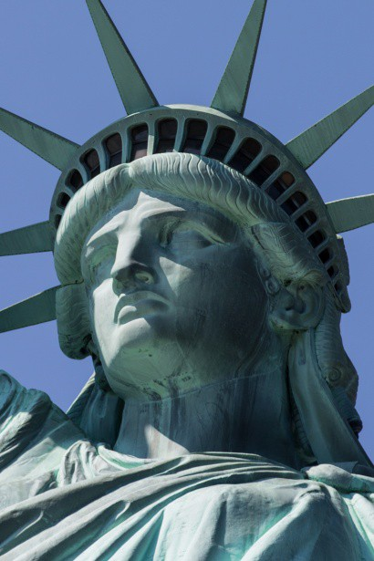

# Book 8 — Libertas

## Chapter 1: Safehouse

Vee, Ray, and Zero have arrived at the safehouse. Vee is setting up comms back to the Blue Cathedral. She has a modified laptop and mobile transmitter. 

“Tech is not my forte, but once we get Wedge on the line we should be OK.” said Vee as she worked.

“Hey Zero, not going to push me down the toilet are ya?” asked Ray. Zero blushed, realizing Ray was the guard he had pushed down the pipe on his way into Earth.

“No hard feelings?” asked Zero, extending his right hand. Ray shook Zero’s hand firmly. “All’s fair in love and war.” said Ray.
